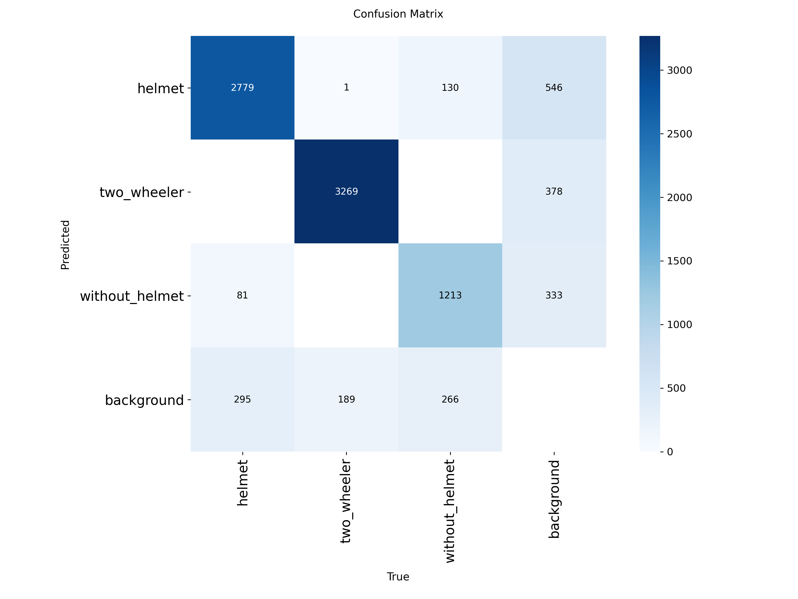

# 🪖 Helmet Detection using YOLOv11s

## Project Overview

This project implements a **computer vision system for detecting helmet usage among motorcycle riders** using a deep learning object detection model.

The system analyzes traffic images and identifies whether a rider is wearing a helmet by placing bounding boxes around detected objects.

The model was trained using **YOLOv11s** on a labeled traffic dataset and can be applied to:

- Automated traffic monitoring
- Road safety enforcement
- Smart city surveillance systems

---

# Dataset

## Source

The dataset used for this project was obtained from **Roboflow Universe**:

https://universe.roboflow.com/hzhf/helmet-wearing-detection-vweez/dataset/10

## Dataset Split

| Dataset | Images |
|------|------|
| Train | 10,494 |
| Validation | 992 |
| Test | 512 |

The dataset contains traffic images of riders annotated with bounding boxes.

## Classes in Dataset

The original dataset contains three classes:

- Helmet
- Without Helmet
- Two Wheeler

However, the objective of this project was specifically to detect helmet usage.

The `two_wheeler` class was not required for the final objective and often produced overlapping detections with helmet-related predictions.

Therefore, during inference the `two_wheeler` class is filtered out so that the system focuses only on:

- Helmet
- Without Helmet

This ensures the detection output directly reflects helmet usage.

---

# Model Selection

## Why YOLOv11s

The **YOLOv11s** model was selected because it provides a good balance between **accuracy and computational efficiency**.

Advantages of YOLOv11s:

- Good detection accuracy
- Low computational cost
- Faster inference than larger models
- Suitable for real-time applications
- Efficient for GPUs with limited VRAM

Larger models such as **YOLOv11m or YOLOv11l** can achieve higher accuracy but require more computational resources.

---

# Model Training

The model was trained using the **Ultralytics YOLO framework**.

| Parameter | Value |
|------|------|
| Model | YOLOv11s |
| Epochs | 80 |
| Image Size | 640 |
| Batch Size | 16 |
| Optimizer | AdamW |
| Initial Learning Rate | 0.001 |
| LR Scheduler | Cosine Learning Rate |
| Weight Decay | 0.0005 |

---

# Data Augmentation

To improve generalization, the following augmentations were applied during training:

- Mosaic augmentation
- MixUp augmentation
- Random horizontal flipping
- Random scaling and translation
- HSV color augmentation

These augmentations help the model adapt to **different lighting conditions, traffic density, and camera perspectives**.

---

# Training Performance

Training metrics were logged during training.

The best performing checkpoint occurred at:

**Epoch 66 — mAP@0.5 ≈ 0.87484**

Small fluctuations after this point are expected due to:

- stochastic gradient updates
- data augmentation randomness
- learning rate scheduling

---

# Training Curves

The following graph shows the training and validation metrics recorded during training.

Metrics shown include:

- Box Loss
- Classification Loss
- DFL Loss
- Precision
- Recall
- mAP

---

# Model Evaluation

Evaluation was performed on the validation dataset.

## Overall Metrics

| Metric | Value |
|------|------|
| Precision | 0.423 |
| Recall | 0.367 |
| mAP@0.5 | 0.425 |
| mAP@0.5:0.95 | 0.217 |

## Helmet Class Performance

| Metric | Value |
|------|------|
| Precision | 0.846 |
| Recall | 0.734 |
| mAP@0.5 | 0.849 |
| mAP@0.5:0.95 | 0.432 |

The model performs well in detecting **helmet usage**, while overall metrics are affected by **class imbalance and dataset complexity**.

---

# Confusion Matrix

The confusion matrix shows the model's classification performance across different classes.

---

# Sample Predictions

Example detections produced by the trained model.

Bounding boxes indicate detected objects and their predicted class labels.

---

# Technologies Used

- Python
- Ultralytics YOLOv11
- PyTorch
- OpenCV
- Roboflow
- Streamlit

---

# Project Structure
