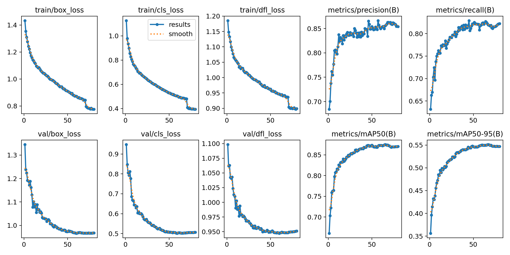
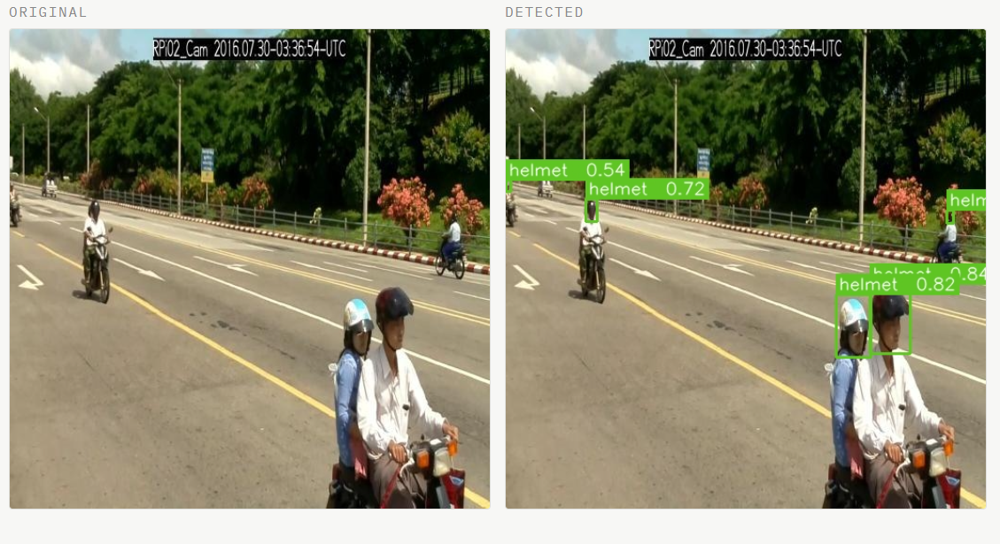
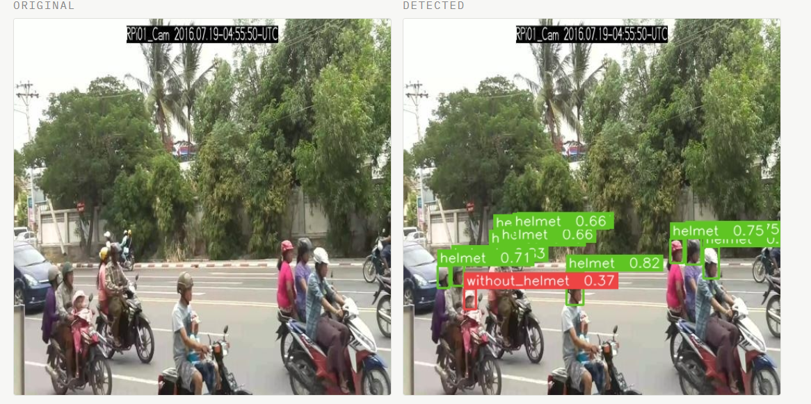

# 🪖 Helmet Detection using YOLOv11s

## Project Overview

This project implements a **computer vision system for detecting helmet usage among motorcycle riders** using a deep learning object detection model.

The system analyzes traffic images and identifies whether a rider is wearing a helmet by placing bounding boxes around detected objects.

The model was trained using **YOLOv11s** on a labeled traffic dataset and can be applied to:

- Automated traffic monitoring
- Road safety enforcement
- Smart city surveillance systems

---

## Dataset

### Source

The dataset used for this project was obtained from **Roboflow Universe**:

[Helmet Wearing Detection Dataset](https://universe.roboflow.com/hzhf/helmet-wearing-detection-vweez/dataset/10)

### Dataset Split

| Split      | Images |
|------------|--------|
| Train      | 10,494 |
| Validation | 992    |
| Test       | 512    |

The dataset consists of traffic images annotated with bounding boxes for helmet detection.

### Classes in Dataset

The original dataset contains three classes:

- `Helmet`
- `Without Helmet`
- `Two Wheeler`

However, the objective of this project is specifically to detect helmet usage. The `two_wheeler` class was not required for the final objective and often caused overlapping detections with helmet-related predictions.

Therefore, during inference the `two_wheeler` class was filtered out, allowing the system to focus only on:

- `Helmet`
- `Without Helmet`

This improves the clarity of detection results and aligns the output with the project objective.

---

## Model Selection

### Why YOLOv11s

The **YOLOv11s** model was selected because it provides a good balance between **accuracy and computational efficiency**.

Advantages of YOLOv11s:

- Good detection accuracy
- Low computational cost
- Faster inference than larger models
- Suitable for real-time applications
- Efficient for GPUs with limited VRAM

> Larger models such as **YOLOv11m** or **YOLOv11l** can achieve higher accuracy but require more computational resources.

---

## Model Training

The model was trained using the **Ultralytics YOLO framework**.

| Parameter              | Value                |
|------------------------|----------------------|
| Model                  | YOLOv11s             |
| Epochs                 | 80                   |
| Image Size             | 640                  |
| Batch Size             | 16                   |
| Optimizer              | AdamW                |
| Initial Learning Rate  | 0.001                |
| LR Scheduler           | Cosine Learning Rate |
| Weight Decay           | 0.0005               |

---

## Data Augmentation

To improve generalization, the following augmentations were applied during training:

- Mosaic augmentation
- MixUp augmentation
- Random horizontal flipping
- Random scaling and translation
- HSV color augmentation

These augmentations help the model adapt to **different lighting conditions, traffic density, and camera perspectives**.

---

## Training Performance

Several evaluation curves were generated during training.

### F1–Confidence Curve

The F1 score represents the balance between precision and recall. The best F1 score occurs around a confidence threshold of approximately **0.36**, reaching around **0.84**, indicating a strong balance between detecting helmets and minimizing false detections.

### Precision–Confidence Curve

This curve shows how detection precision varies with the confidence threshold. Higher confidence thresholds produce more reliable predictions, although fewer detections are made.

### Precision–Recall Curve

The Precision–Recall curve is used to compute **Mean Average Precision (mAP)**. It shows the trade-off between correctly identifying helmets and avoiding false positives.

### Recall–Confidence Curve

Recall decreases as the confidence threshold increases because stricter thresholds reduce the number of predicted detections.

---

## Training Curves

The following graph shows the training and validation metrics recorded during training.



Metrics shown include Box Loss, Classification Loss, DFL Loss, Precision, Recall, and mAP.

---

## mAP Trend During Training

Training metrics were recorded in a CSV log file. The best performance was achieved at:

> **Epoch 66 — mAP@0.5 ≈ 0.87484**

After this point, the mAP fluctuates slightly due to stochastic optimization, data augmentation randomness, and learning rate adjustments. Such fluctuations are normal during deep learning training.

---

## Model Evaluation

Evaluation was performed on the **validation dataset**.

### Overall Metrics

| Metric        | Value |
|---------------|-------|
| Precision     | 0.423 |
| Recall        | 0.367 |
| mAP@0.5       | 0.425 |
| mAP@0.5:0.95  | 0.217 |

### Helmet Class Performance

| Metric        | Value |
|---------------|-------|
| Precision     | 0.846 |
| Recall        | 0.734 |
| mAP@0.5       | 0.849 |
| mAP@0.5:0.95  | 0.432 |

The model performs well in detecting **helmet usage**, while overall metrics are affected by class imbalance and dataset complexity.


---

## Sample Predictions





Bounding boxes indicate detected objects and their predicted class labels.

---

## Technologies Used

- Python
- Ultralytics YOLOv11
- PyTorch
- OpenCV
- Roboflow
- Streamlit

---

## Project Structure
```
helmet-detection-yolo/
│
├── results/
│   ├── img1.png
│   └── img2.png
│
├── runs/
│   └── detect/
│       └── train/
│           ├── results.png
│           ├── confusion_matrix.png
│           └── weights/
│               └── best.pt
│
├── app.py
├── dataset.yaml
├── helmet-detect-v11s.pt
└── README.md
```

---

## Limitations

- **Occlusion in crowded scenes** — Riders may partially block each other in dense traffic situations, which can reduce detection accuracy.
- **Head coverings vs helmets** — Items such as caps, scarves, or hijabs may occasionally be misclassified because they visually resemble helmets.
- **Top-view camera angles** — Detection accuracy may decrease for top-down surveillance views, as such perspectives are less represented in the dataset.
- **Dataset bias** — Model performance depends on the diversity of the training data. Underrepresented scenarios may reduce detection accuracy.
- **Model size constraints** — The system uses **YOLOv11s**, a lightweight model optimized for fast inference. Larger models such as YOLOv11m or YOLOv11l may achieve higher accuracy.

---

## Conclusion

This project successfully demonstrates the use of **YOLOv11s** for real-time helmet detection in traffic scenarios. The trained model achieves a strong **mAP@0.5 of 0.849** on the helmet class, making it reliable for identifying whether motorcycle riders are wearing helmets.

Key takeaways from this project:

- **YOLOv11s** proved to be an efficient and practical choice, delivering solid accuracy without demanding heavy computational resources.
- Filtering out the `two_wheeler` class during inference significantly improved the clarity and relevance of detection outputs.
- Data augmentation strategies such as mosaic, MixUp, and HSV color jittering contributed to better generalization across varied real-world conditions.
- The lower overall metrics compared to per-class helmet metrics highlight the challenge of **class imbalance**, which could be addressed in future iterations.

Overall, this system provides a solid foundation for automated road safety monitoring and can be extended into a production-grade smart city surveillance pipeline.
